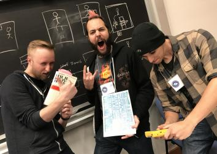

  

# Wave Effect

An 8-bit puzzle game for the original Game Boy. You must travel between two planes in order to solve puzzles. Developed as part of [Global Game Jam 2017](https://globalgamejam.org/2017/games/wave-effect)

  
  

  
  

  

# Tech

Programmed in z80 assembly in the Rednex Game Boy Development Suite.  Runs on a Game Boy flash cart or emulators.

# Credits

Greg - Code, Deisgn, Sound

Graham - Code, Design, Animation

Luigi - Art, Code, Design

Tristian - Sound

Chris - Design
